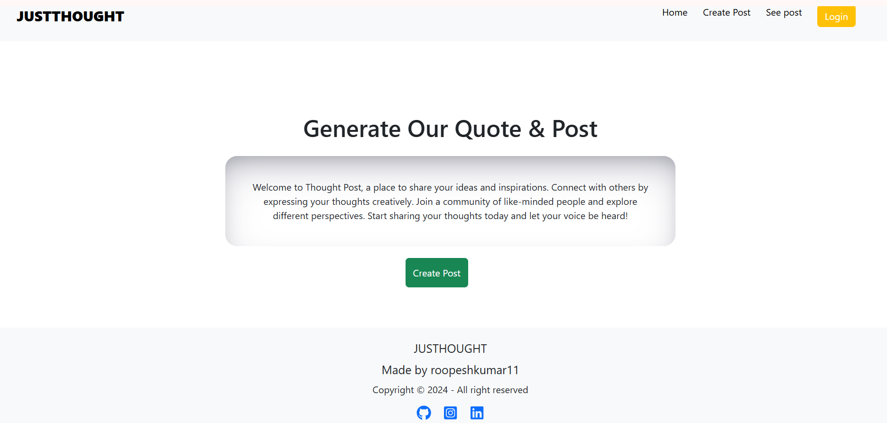

# Project Name

## Description
A full-stack web application built using Vite with React for the frontend and Node.js for the backend. This project provides a fast and efficient development environment with a modern UI and robust backend API. The application allows users to add, update, and delete thoughts.

Users can create and share their thoughts in a simple and intuitive interface. Each thought can be edited or removed as needed. The application ensures a smooth experience with a responsive design and efficient backend services.

## Features
- ⚡ **Frontend:** Vite + React for a blazing-fast development experience
- 🛠 **Backend:** Node.js with Express for handling API requests
- 🔥 **Hot Reloading:** Instant updates for better development
- 🎨 **Styling:** Bootstrap + CSS for modern UI design
- 📦 **Database:** MongoDB
- ✍ **Thought Management:** Users can add, update, and delete thoughts

## Screenshot



## Tech Stack
### Frontend
- Vite
- React
- Bootstrap
- CSS
- Axios (for API calls)

### Backend
- Node.js
- Express.js
- MongoDB

## Installation
### Prerequisites
- Node.js (latest version recommended)
- npm or yarn

### Clone the repository
```sh
git clone https://github.com/your-username/your-repo-name.git
cd your-repo-name
```

### Install dependencies
#### Frontend
```sh
cd frontend
npm install
```
#### Backend
```sh
cd backend
npm install
```

## Running the Application
### Start Backend Server
```sh
cd backend
npm start
```

### Start Frontend
```sh
cd frontend
npm run dev
```

## Environment Variables
Create a `.env` file in the backend folder and add the necessary configurations:
```
PORT=5000
MONGO_URI=your_database_url
```

## API Endpoints
| Method | Endpoint         | Description             |
|--------|-----------------|-------------------------|
| GET    | /api/thoughts   | Get all thoughts       |
| POST   | /api/thoughts   | Add a new thought      |
| PUT    | /api/thoughts/:id | Update a thought       |
| DELETE | /api/thoughts/:id | Delete a thought       |

## Contributing
Contributions are welcome! Please open an issue or submit a pull request.

